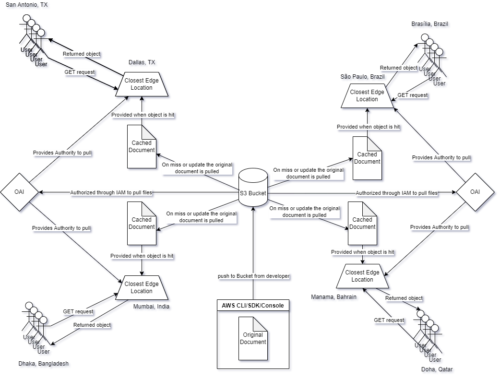

# S3 Bucket AWS

Created from various old projects from Web Technologies and other personal practice projects

Currently hosted [here](https://d5og3tfire9e4.cloudfront.net/)

## Architecture

The repo is stored on a private S3 bucket with all of the assets on the root of the bucket. S3 is a object (essentially file) storage hosted by Amazon with nearly perfect uptime. S3 itself allows the hosting of the files on a static web server, but this would go directly to the S3 instance for the file and be slow for users in locations that are not near the region of that object.

To solve this, AWS' CloudFront technology is used, CloudFront is a CDN service provided globally to all of it's applicable access zones. The access zones use their edge locations each containing a cache of all the objects listed at the root origin, in this case the S3 it is pulling from, and informs public DNS servers of the updated locations, so that any user connecting from specfic locations recieve the closest edge, and recieve the page quicker.

CloudFront uses OAI, or identification that can be applied to the S3 bucket policy so that only the public can pull from the edge locations can get the objects and cannot directly pull from the S3, thus making the S3 objects hidden from the public. The Edge Locations can pull from the bucket on regular updates or when the item is removed from cache and needs to be readded.

